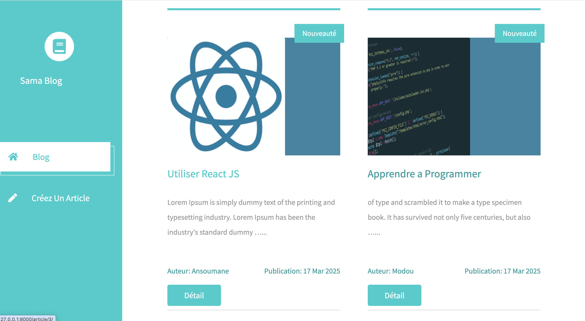
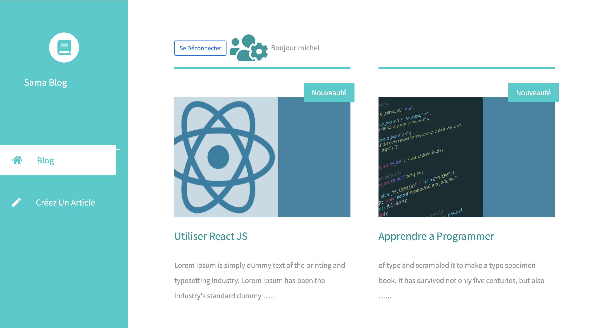
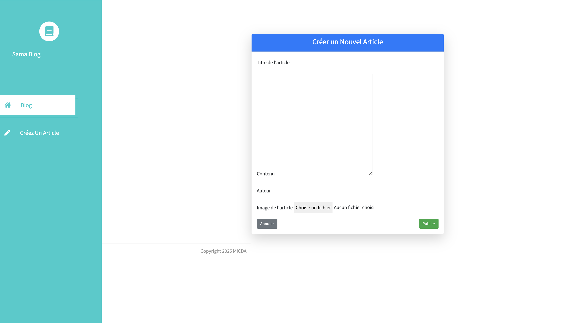
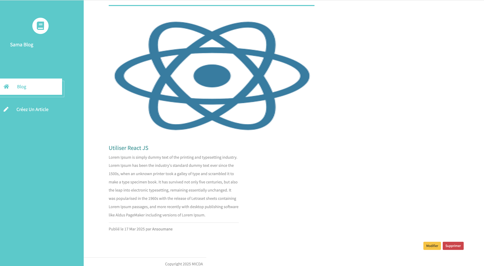
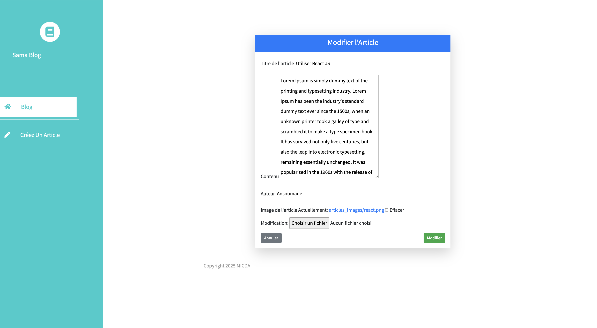
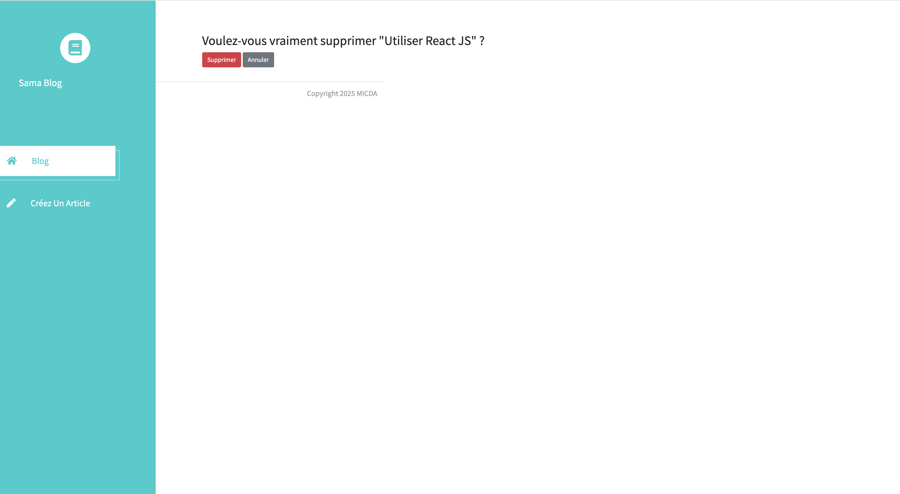
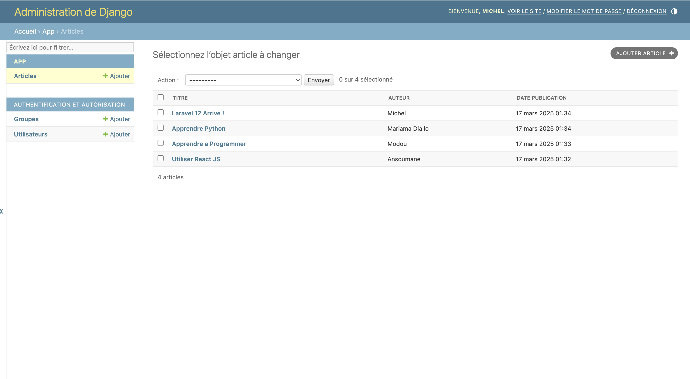

# 1. Configuration du projet

python -m venv venv
source venv/bin/activate  # Sur Linux/Mac  
venv\Scripts\activate  # Sur Windows

# 2. Faire la migration
 
  python manage.py makemigrations

 python manage.py migrate

# 3. Creer un super utilisateur

 python manage.py createsuperuser

# 4. Lancer l'application
 python manage.py runserver

🏠 Accueil

🔐 Login

📓 Utilisateur Connecté

🧩 Creer

📄 Détail

✏️ Modifier

🗑️ Supprimer

🧑‍🧒‍🧒 Dashboard Administrateur
