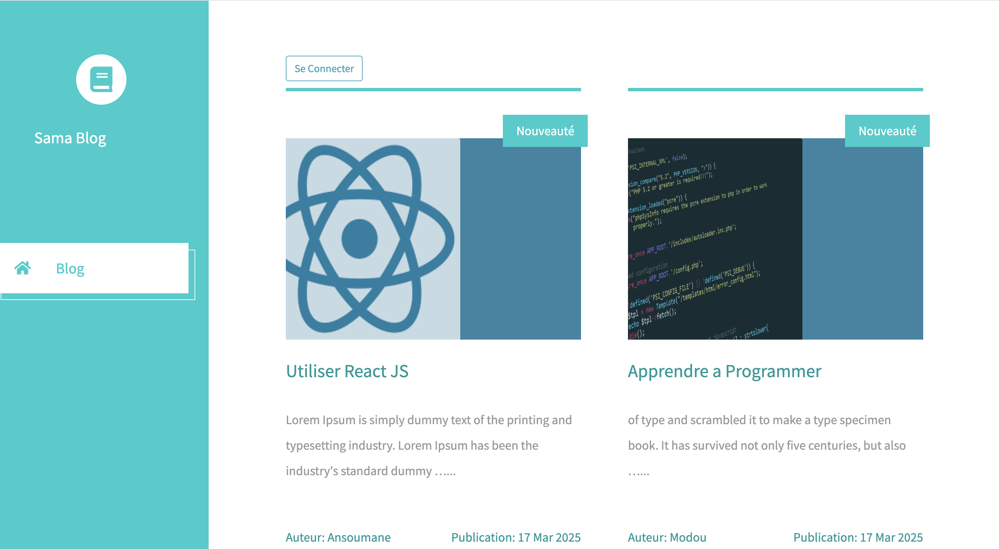
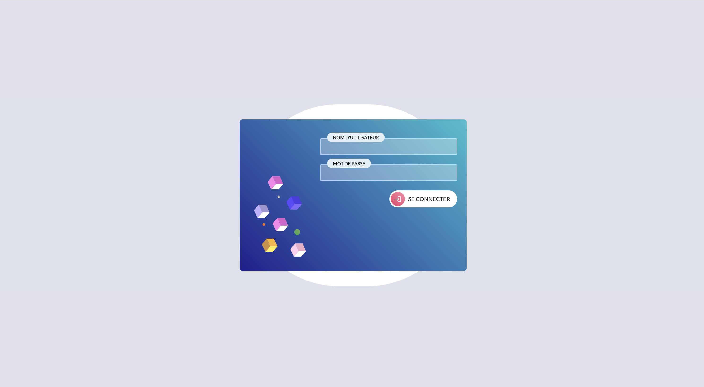

# 1. Configuration du projet

# 1-1 Intaller l'environnement virtuel
python -m venv venv

# 1-2 Activer l'environnement virtuel
python -m venv venv
source venv/bin/activate  # Sur Linux/Mac  
venv\Scripts\activate.bat  # Sur Windows

# 1-3 Installer Django
python -m pip install Django

# 1-4 Installer pillow pour la gestion des images du Blog
python -m pip install Pillow

# 2. Faire la migration
 python manage.py makemigrations

 python manage.py migrate

 # 2-1 Credentiel
  username: michel
  pasword: passer123

# 3. Creer un super utilisateur
 python manage.py createsuperuser

# 4. Lancer l'application
 python manage.py runserver

🏠 Accueil

🔐 Login

📓 Utilisateur Connecté

🧩 Creer

📄 Détail

✏️ Modifier

🗑️ Supprimer

🧑‍🧒‍🧒 Dashboard Administrateur
